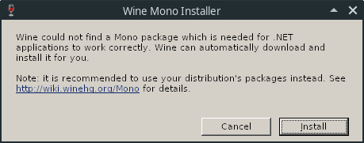
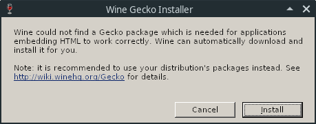
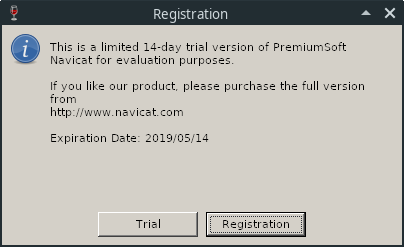

# Navicat Keygen - for Linux

[中文版README](README_FOR_LINUX.zh-CN.md)

## How to use?

> For easier offline activation, we are going to install Navicat to `home`; you can download [Screen recoding](image/Screen_recording.mp4) for references.

1. Run Navicat, for initialization:

    ```bash
    cd ~/navicat121_premium_en_x64 && \
    ./start_navicat
    ```

    When running for the first time, you will be prompted with the following two windows, click "Cancel" to:

    

    

    Until the `Registration` window appears, select `Trial`, close Navicat after loading is complete, and execute `Step 2`:

    

2. Download the latest release [from here](https://github.com/DoubleLabyrinth/navicat-keygen/releases), and extract ：

    ```bash
    curl -O -L https://github.com/DoubleLabyrinth/navicat-keygen/releases/download/v3.1/navicat-keygen-for-x64.zip && \
    unzip navicat-keygen-for-x64.zip
    ```

3. Download `navicat-pacther.sh` and `navicat-keygen.sh`:

    ```bash
    curl -O -L https://raw.githubusercontent.com/zenuo/navicat-keygen/linux/bash/navicat-patcher.sh && \
    chmod +x navicat-patcher.sh && \
    curl -O -L https://raw.githubusercontent.com/zenuo/navicat-keygen/linux/bash/navicat-keygen.sh && \
    chmod +x navicat-keygen.sh
    ```

4. Use `navicat-patcher.exe` to replace __Navicat Activation Public Key__ that is stored in `navicat.exe` or `libcc.dll`.
   
   ```bash
   ./navicat-patcher.sh
   ```
   
   It has been tested on __Navicat Premium 12.1.12 Simplified Chinese version__. The following is an example of output.

   ```
   ***************************************************
   *       Navicat Patcher by @DoubleLabyrinth       *
   *           Release date: Jan 19 2019             *
   ***************************************************

   Press Enter to continue or Ctrl + C to abort.

   MESSAGE: PatchSolution0 will be omitted.

   MESSAGE: PatchSolution3: Keywords[0] has been found:
            Relative Machine Code Offset = +0x0000000001644a08
            Relative Machine Code RVA    = +0x0000000001645608
            Patch Offset                 = +0x00000000023d56e4
            Patch Size                   = 3 byte(s)
   ...
   ...
   ...
   MESSAGE: PatchSolution3: Keywords[110] has been found:
            Relative Machine Code Offset = +0x000000000165155e
            Relative Machine Code RVA    = +0x000000000165215e
            Patch Offset                 = +0x0000000001651561
            Patch Size                   = 1 byte(s)

   MESSAGE: PatchSolution2 will be omitted.

   MESSAGE: PatchSolution1: Keywords[0] has been found: offset = +0x021f7390.
   MESSAGE: PatchSolution1: Keywords[1] has been found: offset = +0x0074bd39.
   MESSAGE: PatchSolution1: Keywords[2] has been found: offset = +0x021f70a0.
   MESSAGE: PatchSolution1: Keywords[3] has been found: offset = +0x0074bd1f.
   MESSAGE: PatchSolution1: Keywords[4] has been found: offset = +0x021f708c.

   MESSAGE: Generating new RSA private key, it may take a long time.
   MESSAGE: New RSA private key has been saved to RegPrivateKey.pem.

   Your RSA public key:
   -----BEGIN PUBLIC KEY-----
   MIIBIjANBgkqhkiG9w0BAQEFAAOCAQ8AMIIBCgKCAQEAsWnV5hQxlXvDA3Ad4k5N
   ZLz4cO+iGEPegSovIDcwTo097I+0pXYKPTVl+0iKC5JtJRObb4Xx9yK9gGwqkcxo
   o6WzKq0xY1jz7X6obxwlQCNse3Os1wr0rIY0UzP1dCpkW/5MwGbFxiB6PEVqkzmJ
   CmHBzZDRu/jAuL1nyoiGnUStqwENNYhyl4k7r8AiJkBZGMOCrj6v0JfgNna25Ce6
   QCFojlY4dkYQ5/7njQ3qpLwMeLEXEysMW3aUScSB68/vsHnB4C0fIkwfEPYZ/AC5
   AqbWHVbNmveB3rjV+tZZxXcLE8ArgKh1Gs+2VtnL09gwHm6WcpyPZ42G6tMDjWyw
   1wIDAQAB
   -----END PUBLIC KEY-----

   ******************************************
   *            PatchSulution3              *
   ******************************************
   @ +023d56e4: 4D 49 49 ---> 4D 49 49
   @ +01644a63: 42 49 ---> 42 49
   @ +01644a68: 6A ---> 6A
   @ +01644ace: 41 ---> 41
   ...
   ...
   ...
   @ +023d58d4: 36 63 6A ---> 47 36 74
   @ +023d58d8: 78 6C 6A 75 75 51 61 ---> 4D 44 6A 57 79 77 31
   @ +023d58e8: 77 49 44 41 ---> 77 49 44 41
   @ +0165155c: 51 41 ---> 51 41
   @ +01651561: 42 ---> 42

   ******************************************
   *            PatchSulution1              *
   ******************************************
   @ +0x021f7390
   Previous:
   +0x00000000021F7390  44 37 35 31 32 35 42 37 30 37 36 37 42 39 34 31  D75125B70767B941
   +0x00000000021F73A0  34 35 42 34 37 43 31 43 42 33 43 30 37 35 35 45  45B47C1CB3C0755E
   +0x00000000021F73B0  37 43 43 42 38 38 32 35 43 35 44 43 45 30 43 35  7CCB8825C5DCE0C5
   ...
   ...
   ...

   @ +0x021f708c
   Previous:
   +0x00000000021F7080  31 32 32 35 4f 45 29 2e 00 00 00 00 39 32 39 33  1225OE).....9293
   +0x00000000021F7090  33 00 00 00 00 00 00 00 00 00 00 00 00 00 00 00  3...............
   After:
   +0x00000000021F7080  31 32 32 35 4f 45 29 2e 00 00 00 00 32 37 45 38  1225OE).....27E8
   +0x00000000021F7090  45 00 00 00 00 00 00 00 00 00 00 00 00 00 00 00  E...............

   MESSAGE: Patch has been done successfully.
   ```

5. Then use `navicat-keygen.exe` to generate __snKey__ and __Activation Code__

   ```
   ./navicat-keygen.sh
   ```

   You will be asked to select Navicat product, language and input major version number. After that an randomly generated __snKey__ will be given.

   ```
   Select Navicat product:
   0. DataModeler
   1. Premium
   2. MySQL
   3. PostgreSQL
   4. Oracle
   5. SQLServer
   6. SQLite
   7. MariaDB
   8. MongoDB
   9. ReportViewer

   (Input index)> 1

   Select product language:
   0. English
   1. Simplified Chinese
   2. Traditional Chinese
   3. Japanese
   4. Polish
   5. Spanish
   6. French
   7. German
   8. Korean
   9. Russian
   10. Portuguese

   (Input index)> 1

   (Input major version number, range: 0 ~ 15, default: 12)> 12

   Serial number:
   NAVO-2ORP-IN5A-GQEE

   Your name: 
   ```

   You can use this __snKey__ to activate your Navicat preliminarily.
     
   Then you will be asked to input `Your name` and `Your organization`. Just set them whatever you want, but not too long.

   ```
   Your name: DoubleLabyrinth
   Your organization: DoubleLabyrinth
   Input request code (in Base64), input empty line to end:
   ```
     
   After that, you will be asked to input the request code. Now __DO NOT CLOSE KEYGEN__.

6. __Set up__ a invalid proxy. Find and click `Registration`. Fill `Registration Key` by __snKey__ that the keygen gave and click `Activate`.

7. Online activation will failed and Navicat will ask you do `Manual Activation`, just choose it.

8. Copy your request code and paste it in the keygen. Input empty line to tell the keygen that your input ends.

   ```
   Your name: DoubleLabyrinth
   Your organization: DoubleLabyrinth

   Input request code (in Base64), input empty line to end:
   t2U+0yfE2FfnbjyhCXa0lglZOHu9Ntc3qyGiPbR6xb1QoU63/9BVfdaCq0blwVycXPyT/Vqw5joIKdM5oCRR/afCPM7iRcyhQMAnvqwc+AOKCqayVV+SqKLvtR/AbREI12w++PQ6Ewfs4A8PgB8OJ9G0jKt6Q/iJRblqi2WWw9mwy+YHcYYh3UAfygTnyj/xl+MzRymbY0lkus+6LPtpDecVsFFhM7F32Ee1QPwISko7bAkHOtkt+joPfYDdn9PDGZ4HEmeLvH6UqZCXkzgaAfynB7cQZFEkId8FsW2NGkbpM7wB2Hi3fNFgOIjutTprixTdbpFKn4w6gGc28ve23A==

   Request Info:
   {"K":"NAVO2ORPIN5AGQEE", "DI":"R91j6WyMhxHznAKSxxxx", "P":"WIN"}

   Response Info:
   {"K":"NAVO2ORPIN5AGQEE","DI":"R91j6WyMhxHznAKSxxxx","N":"DoubleLabyrinth","O":"DoubleLabyrinth","T":1547826060}

   License:
   lRF18o+ZhBphyN0U5kFLHtAAGGXuvhqOcxNuvAk4dJcGeR0ISuw74mQvAfdNjv0T
   I5NZFzqIJvrzM0XeR88q+3kmZkECuxwwWHP3zzDPhPiylcTV4DoGZ1tfoViUSYQc
   LgXG0Fl7koZeP61YOKQ8GfX+Xk2ZTM64bYaF7NlhonM+GQUJCCF2JThmrP921t2p
   b/E5pV6fLOYMM13881ZQcQcltMNVDZn4lzgzKRFFxCQFaTl6fJMHZdYVmICQTHtI
   sNaym0zduc8/cv34mgJ+7NseXmsEPCdjrZ59wgfPsLhZLXqtfxi5hGWw4NMa3Sb2
   UI8dzqFzRp/hSDEM0mEqiA==
   ```

7. Finally, you will get __Activation Code__ which looks like a Base64 string. Just copy it and paste it in Navicat `Manual Activation` window, then click `Activate`. If nothing wrong, activation should be done successfully. Don't forget to close the proxy that we just set up.

